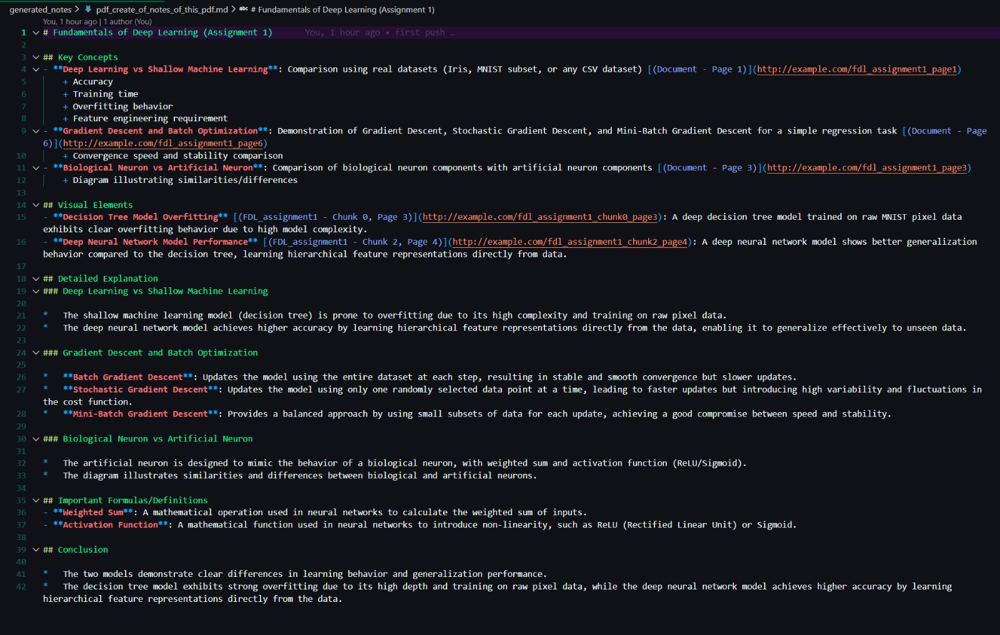

# Axiom — Multi-Modal RAG System

A fully local, offline Multi-Modal Retrieval-Augmented Generation (RAG) pipeline for educational video content. Combines audio transcripts and visual frame analysis to power AI-driven querying, note generation, and interactive teaching — no cloud APIs required.

---

## Features

- **Local-first**: Runs entirely on your machine via [Ollama](https://ollama.ai/) — no data leaves your system.
- **Multi-Modal Search**: Combines audio transcript chunks and visual frame descriptions for richer context.
- **Configurable Chunking**: Select from 5 built-in chunking profiles tailored to different content types.
- **Selectable Embedding Models**: Choose from 5 Ollama embedding models trading off speed vs. quality.
- **Automatic Corruption Handling**: Validates and quarantines corrupt video files before processing.
- **Incremental Processing**: Skips already-processed files; re-processes only corrupted outputs.
- **Three Query Modes**: `locate`, `teach`, and `notes` — each optimized for a different use case.

---

## Tech Stack

| Component | Tool |
|---|---|
| Transcription | [OpenAI Whisper](https://github.com/openai/whisper) (local) |
| Frame extraction | FFmpeg |
| Vision description | Ollama vision models (`moondream`, `llava:7b`, etc.) |
| Embeddings | Ollama (`nomic-embed-text`, `mxbai-embed-large`, etc.) |
| Vector store | [ChromaDB](https://www.trychroma.com/) (persistent, local) |
| LLM inference | Ollama (`llama3.1`) |

---

## Prerequisites

1. **Python 3.10+**
2. **[FFmpeg](https://ffmpeg.org/download.html)** — must be on your system PATH (used for video validation and frame extraction).
3. **[Ollama](https://ollama.ai/)** — for running models locally. After installing, pull the required models:

   ```bash
   # Text embedding model (required)
   ollama pull nomic-embed-text

   # LLM for querying (required)
   ollama pull llama3.1

   # Vision model for frame description (required for visual context)
   ollama pull moondream
   ```

4. **Python dependencies**:
   ```bash
   pip install openai-whisper chromadb ollama
   ```

---

## Pipeline Overview

The full pipeline runs in 5 sequential stages:

```
[videos/]  ──►  ingest_videos.py   ──►  [json/]         (transcripts)
                    │
                    ▼
               extract_frames.py   ──►  [frames/]        (keyframe images)
                    │
                    ▼
               chunks_json.py      ──►  [chunks/]        (text chunks)
                    │
                    ▼
               chunk_embeddings.py ──►  [vector_db/]     (text embeddings)
               embed_frames.py     ──►  [vector_db/]     (frame embeddings)
                    │
                    ▼
               query_videos.py                           (RAG query interface)
```

---

## Usage

### Step 1 — Add Videos

Place your video files in the `videos/` folder. Supported formats: `.mp4`, `.mkv`, `.avi`, `.mov`, `.webm`.

### Step 2 — Transcribe Videos

Validates video integrity via FFprobe, then transcribes audio using local Whisper. Corrupt files are automatically moved to `quarantine/`.

```bash
python ingest_videos.py
```

> Configure `WHISPER_MODEL` in the script (default: `"base"`). Larger models (`small`, `medium`, `large`) are slower but more accurate.

### Step 3 — Extract Frames

Samples one keyframe every 30 seconds from each video (configurable via `FRAME_INTERVAL`), saving JPEG images to `frames/`.

```bash
python extract_frames.py
```

> Requires `ingest_videos.py` to have run first (needs transcript files to determine video duration).

### Step 4 — Chunk Transcripts

Splits the raw transcript JSONs into overlapping text chunks. You'll be prompted to choose a **chunking profile**:

| Profile | Max Words | Max Duration | Best For |
|---|---|---|---|
| `podcast` | 400 | 60s | Interviews, discussions |
| `tutorial` | 150 | 15s | How-to guides, quick tips |
| `lecture` | 300 | 45s | Classes, workshops *(default)* |
| `coding` | 250 | 90s | Code walkthroughs |
| `news` | 180 | 20s | News clips |

```bash
python chunks_json.py
```

### Step 5 — Embed Text Chunks

Embeds the chunk files into ChromaDB. You'll be prompted to choose an **embedding model**:

| Profile | Model | Dimension | Best For |
|---|---|---|---|
| `fast` | `nomic-embed-text` | 768 | General content *(default)* |
| `balanced` | `mxbai-embed-large` | 1024 | Educational tutorials |
| `accurate` | `bge-large-en-v1.5` | 1024 | Technical/research content |
| `multilingual` | `paraphrase-multilingual-mpnet-base-v2` | 768 | Non-English videos |
| `code` | `jina-embeddings-v2-base-code` | 768 | Programming tutorials |

```bash
python chunk_embeddings.py
```

### Step 6 — Embed Frames *(optional — enables visual context)*

Uses a local vision model (`moondream` by default, falls back to `llava`, `bakllava`, etc.) to generate text descriptions of each frame, then embeds those descriptions into ChromaDB.

```bash
python embed_frames.py
```

> If no vision model is detected, you'll be prompted to download one automatically.

### Step 7 — Query

Run the interactive query interface. Set the `MODE` constant at the top of `query_videos.py` before running:

```bash
python query_videos.py
```

**Modes:**

| Mode | Description |
|---|---|
| `locate` | Find exact timestamps in videos where a topic is discussed |
| `teach` | Get a detailed, contextual explanation combining transcript + visuals |
| `notes` | Auto-generate structured Markdown notes saved to `generated_notes/` |

---

## Directory Structure

```
axiom_proto1.2/
├── videos/               # Input: raw video files
├── json/                 # Whisper transcript outputs (.json)
├── frames/               # Extracted keyframes (per-video subdirectories)
├── chunks/               # Chunked transcript files (*_chunks.json)
├── vector_db/            # ChromaDB persistent store (text + frame embeddings)
├── generated_notes/      # Output: Markdown notes from "notes" mode
├── quarantine/           # Corrupt/invalid video files (auto-quarantined)
│
├── ingest_videos.py      # Stage 1: Validate & transcribe videos
├── extract_frames.py     # Stage 2: Extract keyframes via FFmpeg
├── chunks_json.py        # Stage 3: Split transcripts into chunks
├── chunk_embeddings.py   # Stage 4: Embed text chunks → ChromaDB
├── embed_frames.py       # Stage 5: Describe + embed frames → ChromaDB
└── query_videos.py       # Stage 6: Multi-modal RAG query interface
```

---

## Configuration Reference

| Script | Key Config | Default |
|---|---|---|
| `ingest_videos.py` | `WHISPER_MODEL` | `"base"` |
| `extract_frames.py` | `FRAME_INTERVAL` | `30` (seconds) |
| `extract_frames.py` | `MAX_FRAMES_PER_VIDEO` | `200` |
| `embed_frames.py` | `EMBED_MODEL` | `"nomic-embed-text"` |
| `query_videos.py` | `MODE` | `"notes"` |
| `query_videos.py` | `LLM_MODEL` | `"llama3.1"` |
| `query_videos.py` | `TOP_K_TEXT` | `8` chunks |
| `query_videos.py` | `TOP_K_FRAMES` | `3` frames |
| `query_videos.py` | `MAX_DISTANCE` | `260` |


---

## Example Output

### `notes` mode

Below is a sample output generated by running `query_videos.py` with `MODE = "notes"`.
The result is a structured Markdown file automatically saved to `generated_notes/`.


